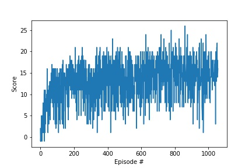

# Project report

## Deep Q-Learning algorithm implementation details

The RL algorithm used is Deep Q Learning with *Fixed Q-targets* and *random experience replay* as described in [original paper](https://storage.googleapis.com/deepmind-media/dqn/DQNNaturePaper.pdf).
But the input is not an image and so fully connected layers are used instead of convolutional layers. The details of the network is provided below:

- Fully connected layer - input: 37 (state size) output: 64 activation : Relu
- Fully connected layer - input: 64 output 64 activation : Relu
- Fully connected layer - input: 64 output: 4 (action size) 

The above model is defined using Pytorch.

Q-model training parameters:

- batch size = 64  
- Optimizer : Adam
- Learning rate = 1e-3
- Loss : MSE

RL training parameters:

- Replay buffer size = 1e5
- discount rate = 0.99
- soft update value = 5e-3
- Target model update frequency : 4 time steps
- Maximum steps per episode: 1000
- Maximum episodes = 2000
- Starting epsilion = 1.0
- Ending epsilion = 0.01
- Epsilion decay rate = 0.925

## Results

### Training Plot
Plot showing the RL training with respect to average rewards over last 100 episodes. 


### Training Output
```
Episode 100	Average Score: 7.89
Episode 200	Average Score: 9.83
Episode 300	Average Score: 10.65
Episode 400	Average Score: 11.18
Episode 500	Average Score: 11.60
Episode 600	Average Score: 11.84
Episode 700	Average Score: 12.20
Episode 800	Average Score: 12.51
Episode 900	Average Score: 12.75
Episode 1000	Average Score: 12.88
Episode 1057	Average Score: 13.00
Environment solved in 957 episodes!	Average Score: 13.00
```

## Ideas for future work

1. Extensive hyperparameter optimization
2. Double Deep Q Networks
3. Prioritized Experience Replay
4. Dueling Deep Q Networks